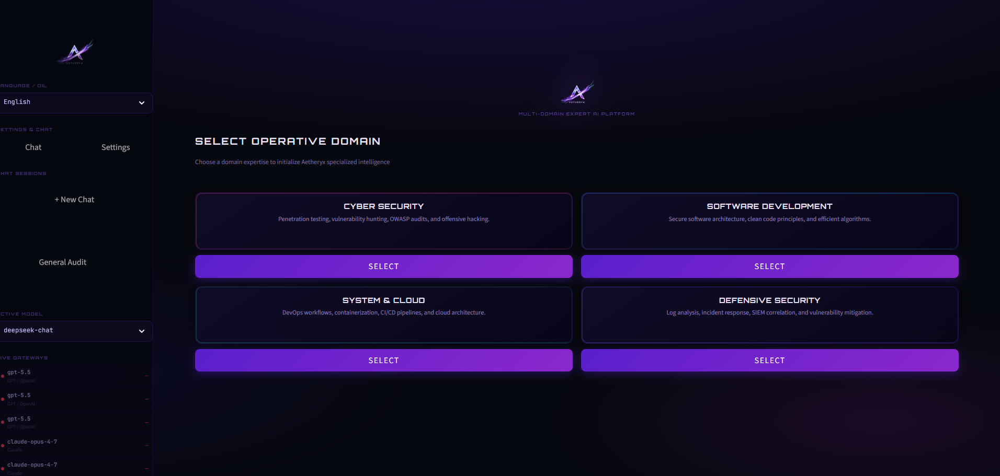
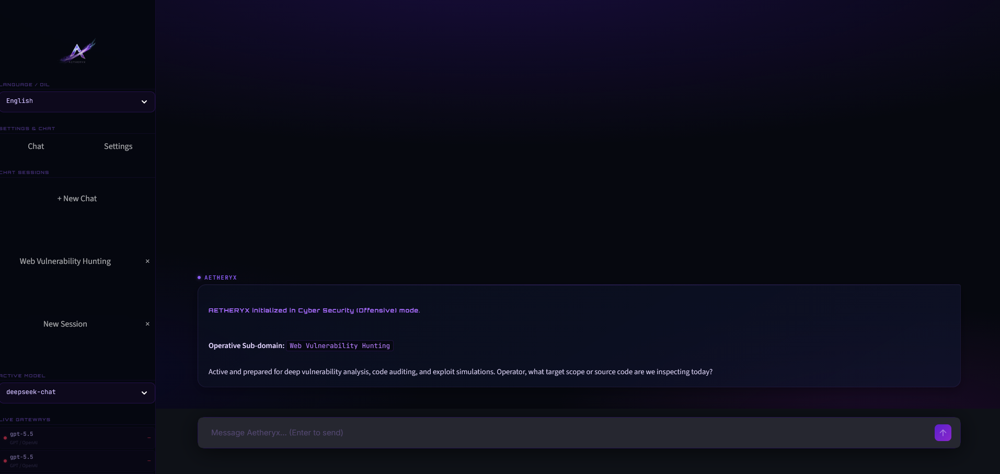
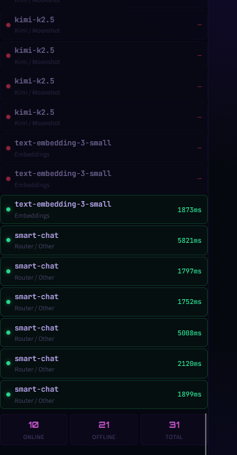

<div align="center">


# AETHERYX

**Multi-Domain Expert AI Orchestration Platform**

[](https://python.org)
[](https://streamlit.io)
[](LICENSE)
[]()

*A premium, cyber-terminal AI assistant with live free API gateway orchestration, multi-domain expert personas, and a glassmorphism dark UI — all running locally.*

</div>

---

## 📸 Screenshots

> Add your screenshots to the `assets/screenshots/` folder and update the paths below.

| Domain Selection | Active Chat |
|:---:|:---:|
|  |  |

| Sidebar | Settings |
|:---:|:---:|
|  |  |

---

## ✨ Features

### 🎭 Multi-Domain Expert Personas
Pick a domain and Aetheryx dynamically loads a fully specialized system prompt and persona:

| Domain | Sub-Domains | AI Persona |
|---|---|---|
| 🎯 **Cyber Security** | Web Vulns, API Pentest, Network Scan, Mobile APK | Offensive Hacker |
| 💻 **Software Development** | Clean Code, Backend/API, Database Design, Algorithms | Lead Architect |
| ☁️ **System & Cloud** | Docker/K8s, CI/CD, AWS/GCP, Linux Admin | SysAdmin |
| 🛡️ **Defensive Security** | Log Analysis, Incident Response, Threat Hunting, Hardening | SOC Analyst |

### 🔌 Live Free API Gateway Orchestration
- **Auto-probes** public OpenAI-compatible keys on startup (no API key required to get started)
- **Smart routing** — matches model names to the best available gateway (`deepseek-chat`, `gemini-2.5-flash/pro`, `gpt-4o`, `smart-chat`)
- **Automatic failover** — if a gateway is rate-limited, hops to the next active key seamlessly
- **Custom API support** — plug in your own OpenAI / Anthropic / DeepSeek / Gemini key for unlimited, private usage

### 💬 Multi-Session Chat
- Multiple persistent chat threads in the sidebar
- Auto-renames sessions based on your first message
- Two-step delete confirmation (`×` → `✓`) to prevent accidents

### 🎨 Premium Cyber-Terminal UI
- Dark glassmorphism panels with purple gradient accents
- Smooth splash screen with animated logo on load
- Animated thinking indicator while AI responds
- Inline copy buttons on all code blocks
- Fully responsive — works on any screen size

### 🌐 Bilingual (TR / EN)
Full Turkish and English localization — switch instantly from the sidebar.

---

## 🛠️ Setup

### Prerequisites
- Python 3.10+
- pip

### 1. Clone the repository
```bash
git clone https://github.com/efemehmet1965/aetheryx.git
cd aetheryx
```

### 2. Install dependencies
```bash
pip install -r requirements.txt
```

### 3. Run
```bash
streamlit run app.py
```

Open **http://localhost:8501** in your browser.

---

## ⚙️ Configuration

### Using Free Public Gateways (Default)
No setup needed. Aetheryx automatically fetches and tests free public API keys on startup.

### Using Your Own API Key
1. Open the app → click **Ayarlar / Settings** in the sidebar
2. Switch **Source** to `Custom API Key`
3. Select your provider (OpenAI, Anthropic, DeepSeek, Gemini)
4. Paste your key

Your key is stored only in local session memory and sent directly to the provider — never intercepted.

---

## 📁 Project Structure

```
aetheryx/
├── app.py                  # Main Streamlit application
├── requirements.txt        # Python dependencies
├── assets/
│   ├── logo.png            # App logo (used in splash + sidebar)
│   └── screenshots/        # Add your screenshots here
├── core/
│   ├── key_fetcher.py      # Free API gateway scraper & tester
│   └── llm_router.py       # Multi-provider LLM routing logic
└── .gitignore
```

---

## 🔒 Privacy & Security

- **No telemetry** — Aetheryx doesn't call home. All logic runs locally.
- **Keys stay local** — Custom API keys live only in `st.session_state` for the duration of your browser session.
- **No data stored** — Chat history is in-memory only; nothing is written to disk.
- **Cache only** — `free_keys_cache.json` (gitignored) caches gateway probe results locally to speed up subsequent launches.

---

## 📦 Dependencies

| Package | Purpose |
|---|---|
| `streamlit >= 1.30` | UI framework |
| `requests >= 2.31` | HTTP requests for gateway probing |
| `urllib3 >= 2.0` | Connection pooling |

## 🤝 Credits & Acknowledgments

Aetheryx is built with inspiration and support from the open-source community. Special thanks to the following projects:

1. **[alistaitsacle/free-llm-api-keys](https://github.com/alistaitsacle/free-llm-api-keys)** — For maintaining the public list of live, active, OpenAI-compatible API gateway keys.
2. **[pekpik](https://github.com/pekpik)** — For the high-performance public API gateway endpoint proxy.

---

## 📄 License

MIT License — see [LICENSE](LICENSE) for details.

---

## 🙌 Acknowledgements

Aetheryx was built with inspiration and support from the following open-source projects:

### 🔑 Free LLM Gateway Aggregation
https://github.com/alistaitsacle/free-llm-api-keys

Used as a reference/foundation for:
- Free public API gateway discovery
- API key aggregation
- Gateway probing logic

---

### 🛡️ Security Workflow Inspiration
https://github.com/elementalsouls/Claude-BugHunter

Inspired parts of:
- Security-focused prompt engineering
- Offensive security assistant behavior
- Cybersecurity workflow structures

Huge respect to the open-source community.

---

<div align="center">

Built with ⚡ by the github.com/efemehmet1965

*Star ⭐ the repo if you find it useful!*

</div>
